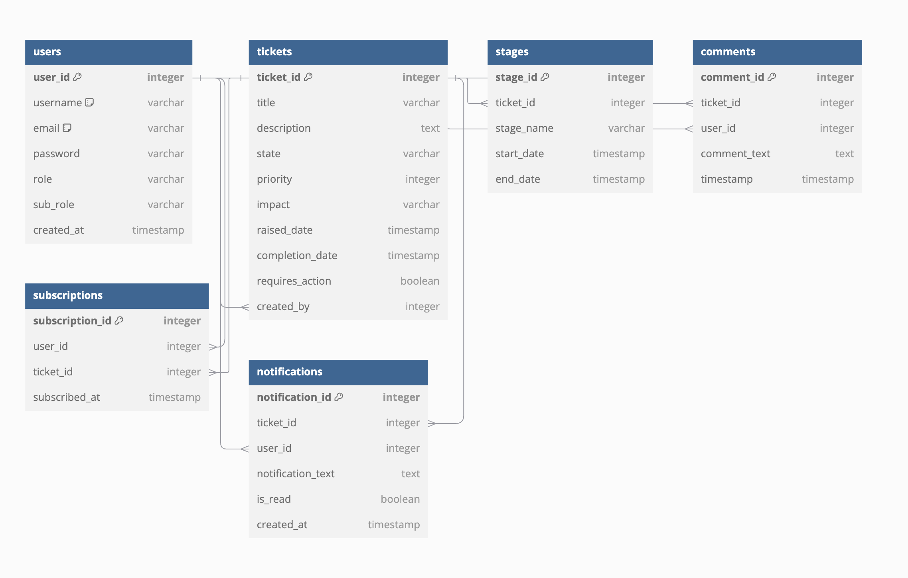
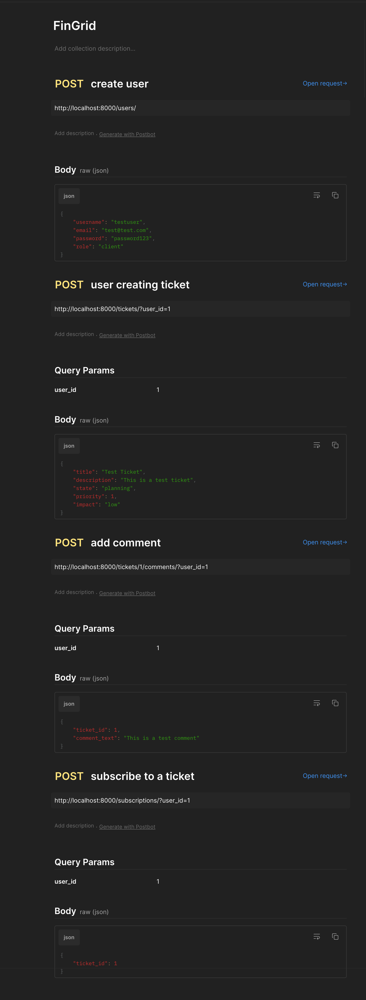

# FinGrid

## Creating and activating .vevn

```bash
python3 -m venv .venv
source .venv/bin/activate
```

## Installing requirements

```bash
pip install -r requirements.txt
```

## run the app

```bash
cd backend/app

uvicorn main:app --reload
```

## Example of .env file content

is contained int he example file .env.example

## Running the translataion script

```bash
python tranlate.py
```

### DB schema ERD



## Postman endpoints


